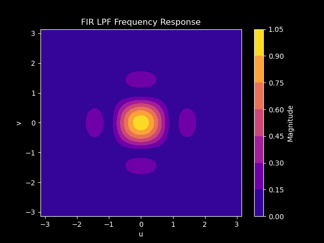
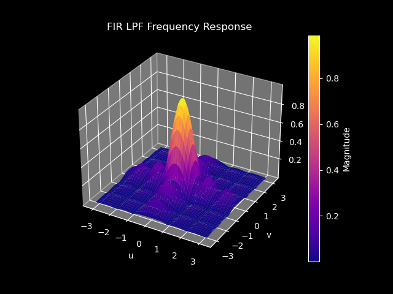
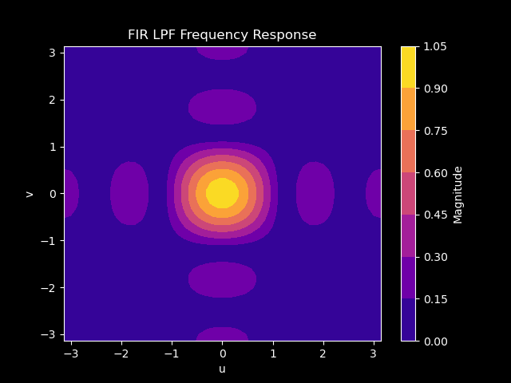
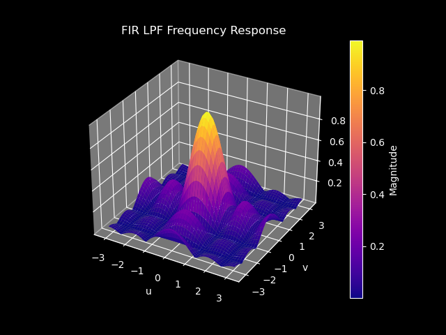
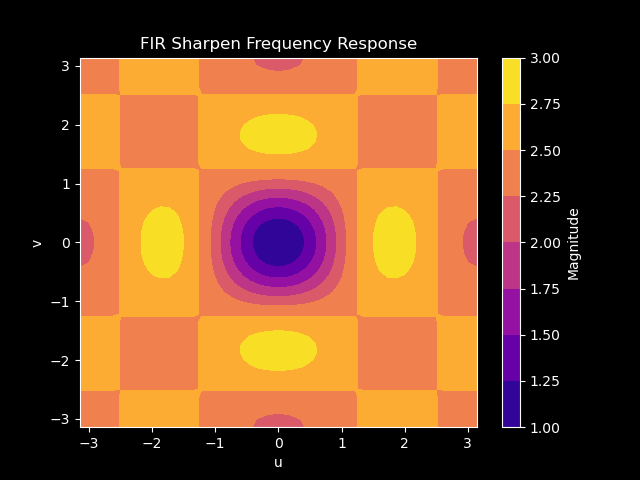
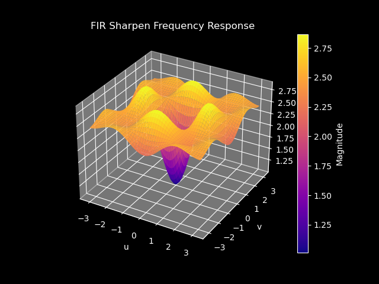
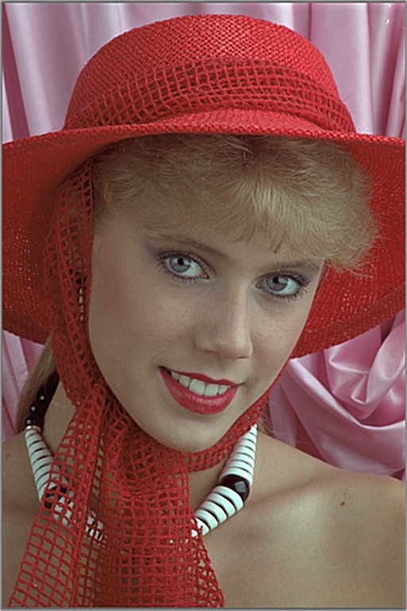
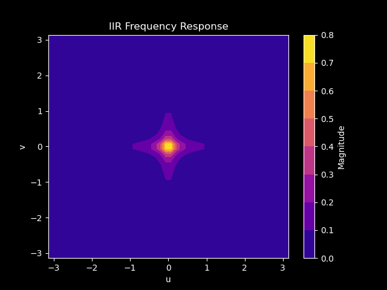
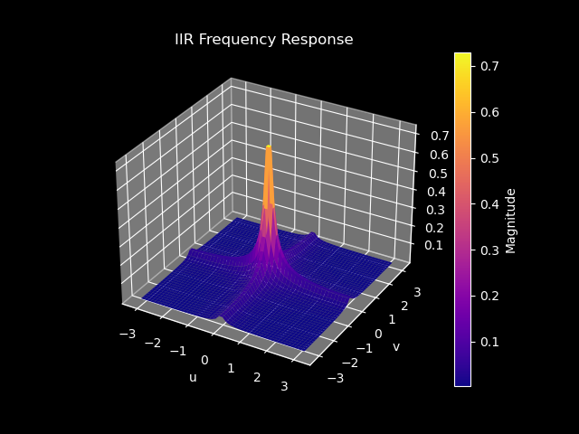

## FIR Low Pass Filter

Analyze and implement a simple low pass filter given by the 9 × 9 point spread fumction:

$$
h(m, n) = \begin{cases}
    1/81 &\text{for } |m| \leq 4 &\text{and } |n| \leq 4 \\
    0 &\text{otherwise}
\end{cases}
$$

### Derivation

We can plot the magnitude of the impulse response by finding the analytical expression for $H(e^{ju}, e^{jv})$ across all values, which is the DSFT:

$$
H(u, v) = \sum_{n=-\infin}^{\infin} \sum_{m=-\infin}^{\infin} f(n, m) e^{-j(um + vn)}
$$

We can substitute $\frac{1}{81}$ within the range $-4\leq{n,m}\leq4$ since that is the only non-zero piece of the fumction and get the following:

$$
H(u, v) = \sum_{n=-4}^{4} \sum_{m=-4}^{4} \frac{1}{81} e^{-j(um + vn)}
$$

### Frequency Response Plots




### Images

#### Input image


#### Filtered Image


### Code

```C
#include <math.h>
#include "tiff.h"
#include "allocate.h"
#include "randlib.h"
#include "typeutil.h"

void error(char *name);
void apply2DFIRFilter(uint8_t **input, uint8_t **output, int height, int width);

int main(int argc, char **argv)
{
  FILE *fp;
  struct TIFF_img input_img, output_img;

  if (argc != 2)
    error(argv[0]);

  /* open image file */
  if ((fp = fopen(argv[1], "rb")) == NULL)
  {
    fprintf(stderr, "cannot open file %s\n", argv[1]);
    exit(1);
  }

  /* read image */
  if (read_TIFF(fp, &input_img))
  {
    fprintf(stderr, "error reading file %s\n", argv[1]);
    exit(1);
  }

  /* close image file */
  fclose(fp);

  /* check the type of image data */
  if (input_img.TIFF_type != 'c')
  {
    fprintf(stderr, "error:  image must be 24-bit color\n");
    exit(1);
  }

  /* set up structure for output color image */
  /* Note that the type is 'c' rather than 'g' */
  get_TIFF(&output_img, input_img.height, input_img.width, 'c');

  apply2DFIRFilter(input_img.color[0], output_img.color[0], input_img.height, input_img.width);
  apply2DFIRFilter(input_img.color[1], output_img.color[1], input_img.height, input_img.width);
  apply2DFIRFilter(input_img.color[2], output_img.color[2], input_img.height, input_img.width);

  /* open image file */
  if ((fp = fopen("fir_lpf.tif", "wb")) == NULL)
  {
    fprintf(stderr, "cannot open file fir_lpf.tif\n");
    exit(1);
  }

  /* write image */
  if (write_TIFF(fp, &output_img))
  {
    fprintf(stderr, "error writing TIFF file %s\n", argv[2]);
    exit(1);
  }

  /* close image file */
  fclose(fp);

  /* de-allocate space which was used for the images */
  free_TIFF(&(input_img));
  free_TIFF(&(output_img));

  return (0);
}

const uint8_t FILTER_SIZE = 9;
const double FILTER_COEFFICIENT = 1.0 / 81.0;

void apply2DFIRFilter(uint8_t **input, uint8_t **output, int height, int width)
{
  int filterRadius = FILTER_SIZE / 2;

  for (int i = 0; i < height; ++i)
  {
    for (int j = 0; j < width; ++j)
    {
      // printf("calculating sum for r%d c%d\t", i, j);
      double sum = 0.0;
      for (int m = 0; m < FILTER_SIZE; ++m)
      {
        for (int n = 0; n < FILTER_SIZE; ++n)
        {
          int rowIdx = i - filterRadius + m;
          int colIdx = j - filterRadius + n;
          // printf("i: r%d c%d ", rowIdx, colIdx);

          // Check boumdaries
          if (rowIdx >= 0 && rowIdx < height && colIdx >= 0 && colIdx < width)
          {
            sum += FILTER_COEFFICIENT * (double)input[rowIdx][colIdx];
          }
        }
      }
      // printf("raw sum %f\n", sum);

      // Clip the result to the 0-255 range
      output[i][j] = (uint8_t)(sum < 0 ? 0 : (sum > 255 ? 255 : sum));
    }
  }
}

void error(char *name)
{
  printf("usage:  %s  image.tiff \n\n", name);
  printf("this program reads in a 24-bit color TIFF image.\n");
  printf("It then horizontally filters the green component, adds noise,\n");
  printf("and writes out the result as an 8-bit image\n");
  printf("with the name 'green.tiff'.\n");
  printf("It also generates an 8-bit color image,\n");
  printf("that swaps red and green components from the input image");
  exit(1);
}

```

## FIR Sharpening Filter

### Derivation of $H(u, v)$

We can plot the magnitude of the impulse response by finding the analytical expression for $H(e^{ju}, e^{jv})$ across all values, which is the DSFT:

$$
H(u, v) = \sum_{n=-\infin}^{\infin} \sum_{m=-\infin}^{\infin} f(n, m) e^{-j(um + vn)}
$$

We can substitute $\frac{1}{25}$ within the range $-2\leq{n,m}\leq2$ since that is the only non-zero piece of the fumction and get the following:

$$
H(u, v) = \sum_{n=-2}^{2} \sum_{m=-2}^{2} \frac{1}{25} e^{-j(um + vn)}
$$

### $H(u, v)$ Frequency Response Plots




### Derivation of $G(u, v)$

To find an expression for $G(e^{ju}, e^{jv})$, we apply the DSFT to $g(m, n)$:

$$
G(u, v) = \sum_{n=-\infin}^{\infin} \sum_{m=-\infin}^{\infin} g(m,n) e^{-j(um + vn)}
$$

Substituting, we get the following:

$$
G(u, v) = \sum_{n=-2}^{2} \sum_{m=-2}^{2} (\delta(m,n) + \lambda(\delta(m,n) - h(m,n))) e^{-j(um + vn)}
$$

Substituting for h(m,n) and reducing, we get:

$$
G(u, v) = (1 + \lambda(1 - \sum_{n=-2}^{2} \sum_{m=-2}^{2}\frac{1}{25} e^{-j(um + vn)}))
$$

### $G(u, v)$ Frequency Response Plots for $\lambda = 1.5$





### Input Blurred Image


### Sharpened Input Image



### Code

```C
#include <math.h>
#include "tiff.h"
#include "allocate.h"
#include "randlib.h"
#include "typeutil.h"

void error(char *name);
void apply2DFIRSharpenFilter(uint8_t **input, uint8_t **output, int height, int width, int filter_size, double lambda);

int main(int argc, char **argv)
{
    FILE *fp;
    struct TIFF_img input_img, output_img;

    if (argc != 3)
        error(argv[0]);

    double lambda = atof(argv[2]);

    /* open image file */
    if ((fp = fopen(argv[1], "rb")) == NULL)
    {
        fprintf(stderr, "cannot open file %s\n", argv[1]);
        exit(1);
    }

    /* read image */
    if (read_TIFF(fp, &input_img))
    {
        fprintf(stderr, "error reading file %s\n", argv[1]);
        exit(1);
    }

    /* close image file */
    fclose(fp);

    /* check the type of image data */
    if (input_img.TIFF_type != 'c')
    {
        fprintf(stderr, "error:  image must be 24-bit color\n");
        exit(1);
    }

    /* set up structure for output color image */
    /* Note that the type is 'c' rather than 'g' */
    get_TIFF(&output_img, input_img.height, input_img.width, 'c');

    apply2DFIRSharpenFilter(input_img.color[0], output_img.color[0], input_img.height, input_img.width, 5, lambda);
    apply2DFIRSharpenFilter(input_img.color[1], output_img.color[1], input_img.height, input_img.width, 5, lambda);
    apply2DFIRSharpenFilter(input_img.color[2], output_img.color[2], input_img.height, input_img.width, 5, lambda);

    /* open image file */
    if ((fp = fopen("fir_sharpen.tif", "wb")) == NULL)
    {
        fprintf(stderr, "cannot open file fir_lpf.tif\n");
        exit(1);
    }

    /* write image */
    if (write_TIFF(fp, &output_img))
    {
        fprintf(stderr, "error writing TIFF file %s\n", argv[2]);
        exit(1);
    }

    /* close image file */
    fclose(fp);

    /* de-allocate space which was used for the images */
    free_TIFF(&(input_img));
    free_TIFF(&(output_img));

    return (0);
}

void apply2DFIRSharpenFilter(uint8_t **input, uint8_t **output, int height, int width, int filter_size, double lambda)
{
    int filterRadius = filter_size / 2;
    double fir_filter_coeff = 1.0 / (double)(filter_size * filter_size);

    for (int i = 0; i < height; ++i)
    {
        for (int j = 0; j < width; ++j)
        {
            // printf("calculating sum for r%d c%d\t", i, j);
            double sum = 0.0;
            for (int m = 0; m < filter_size; ++m)
            {
                for (int n = 0; n < filter_size; ++n)
                {
                    int rowIdx = i - filterRadius + m;
                    int colIdx = j - filterRadius + n;
                    // printf("i: r%d c%d ", rowIdx, colIdx);

                    // Check boundaries
                    if (rowIdx >= 0 && rowIdx < height && colIdx >= 0 && colIdx < width)
                    {
                        if (m == filter_size / 2 && n == filter_size / 2)
                        {
                            sum += (1.0 + lambda * (1 - fir_filter_coeff)) * (double)input[rowIdx][colIdx];
                        }
                        else
                        {
                            sum += -1 * lambda * fir_filter_coeff * (double)input[rowIdx][colIdx];
                        }
                    }
                }
            }
            // printf("raw output %f\n", raw_output);

            // Clip the result to the 0-255 range
            output[i][j] = (uint8_t)(sum < 0 ? 0 : (sum > 255 ? 255 : sum));
        }
    }
}

void error(char *name)
{
    printf("usage:  %s  image.tiff \n\n", name);
    printf("this program reads in a 24-bit color TIFF image.\n");
    printf("It then horizontally filters the green component, adds noise,\n");
    printf("and writes out the result as an 8-bit image\n");
    printf("with the name 'green.tiff'.\n");
    printf("It also generates an 8-bit color image,\n");
    printf("that swaps red and green components from the input image");
    exit(1);
}
```

## IIR Filter

### Derivation of $H(u, v)$

We can plot the magnitude of the impulse response by finding the analytical expression for $H(e^{ju}, e^{jv})$ across all values, which is the DSFT. First, we can find the Z-transform:

$$
H(z_1, z_2) = \frac{0.01}{1 - 0.9z_1^{-1} - 0.9z_2^{-1} + 0.81z_1^{-1}z_2^{-1}}
$$

Converting to a DSFT from the Z-transform is just a simple substitution:

$$
H(e^{ju}, e^{jv}) = \frac{0.01}{1 - 0.9e^{-ju} - 0.9e^{-jv} + 0.81e^{-ju}e^{-jv}}
$$

### Frequency Response Plots




